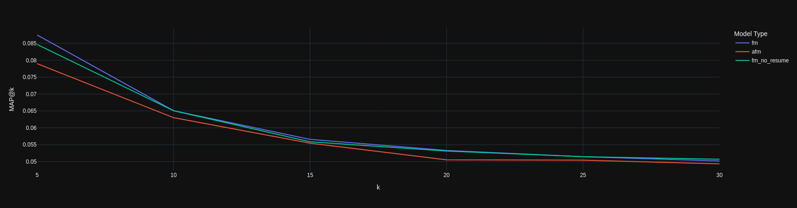

# Introduction
The initial intent of this exercise was build a job recommender using the approach by Du et al. (2024) where they extracted explicit and implicit descriptors about users based on their profile information and interaction record and use an LLM to enrich the users' resumes. To address zero-shot users, the researchers paired them with many-shot users and used a Generative Adversarial Network (GAN) to enrich the resume. The enriched resumes were then compared against job descriptions using traditional similarity metrics.

A resume dataset is needed to train the models in the paper. Unfortunately, these are difficult to obtain openly. Initially, I tried generating synthetic interaction records between two distinct resume and job descriptions datasets. The data required too much hands-on wrangling to make it usable (see Suggestions). I settled on a dataset from the 2012 CareerBuilder.com challenge. This set had categorical data for job-seekers, their interaction history, past job history, and job postings including text fields for the description and requirements (Hamner et al., 2012). An LLM was used to generate resumes for each user based on their categorical features, interactions, and inferred skills (see careerbuilder_wrangling.ipynb).

Unfortunately, the classifiers could not reliably classify strong and weak resumes (see NN_Classifier.ipynb). Until that can be resolved, the original goal is unattainable. Instead, I wanted to see if the LLM-generated resumes could be used with traditional recommender methods. Results from a factorization machine (Rendle, 2010) and attentional factorization machine (Li et al., 2023; Xiao et al., 2017) show significant improvements in MAP@25 scores, however the same factorization machine model with the resume feature removed shows a slight improvement over the same model which includes it. This suggests the inclusion of the resume embedding degrades performance.

### Results
| Model 							|  MAP@25 |
|:---------------------------------:|:--------:|
|Random Baseline 					| 0.0000939|
|SVD								| 0.0001034|
|SVDpp								| 0.0000916|
|User-Based Collaborative Filtering	| 0.0048786|
|Factorization Machine				| 0.0505043|
|Attentional Factorization Machine	| 0.0492574|
|Factorization Machine - No Resume	| 0.0508568|

### Analysis
The performance of the models is subject to a large number of factors which weren't rigorously tested and controlled:
1. LLM model selection for generating resumes (Llama 3.3 70b Instruct)
2. Prompt engineering
3. LLM model tuning parameters (temperature, penalties, etc.)
4. Sentence transformer model selection/tuning
5. Sentence embedding output size
6. Feature selection, engineering, & encoding

I suspect inclusion of the LLM-generated resume data in the recommender models is introducing too much noise. My reasoning is that the Attentional Factorization Machine is susceptible to overfitting (Xiao et al., 2017). The standard Factorization Machine produces a more generalized fit than the AFM and, in this case, provides better performance. The FM with no resume provides even better performance. The LLM generates static structure resumes and perhaps the sentence transformer cannot accurately isolate the important text. Perhaps this system would benefit from scrapping the resume structure and instead generating an inferred skills column based on previous jobs and interaction records.

### Suggestions For Future Exploration
Future efforts can include:
1. Using LLM OCR to scrape text from original resume dataset.
2. Generate a feature column of inferred skills rather than an entire resume.
2. Testing different LLM models and improving tuning and prompts.
3. Selecting/tuning sentence transformer.
4. Improving feature selection, engineering, and encoding.
5. Exploring different interaction methods between resume/job description embeddings.

## Files
1. NN_Classifier.ipynb: Neural net & ML classifiers for judging weak vs. strong resumes
2. careerbuilder_wrangling.ipynb: LLM resume generation & storing in SQLite database
3. CareerBuilder_Competition.ipynb: Testing recommender models & results

## References
Du, Y., Luo, D., Yan, R., Wang, X., Liu, H., Zhu, H., Song, Y., & Zhang, J. (2024). Enhancing Job Recommendation through LLM-Based Generative Adversarial Networks. Proceedings of the AAAI Conference on Artificial Intelligence, 38(8), 8363–8371. https://doi.org/10.1609/aaai.v38i8.28678

Hamner, B., Warrior, R., & Krupa, W. (2012). Job Recommendation Challenge. https://kaggle.com/competitions/job-recommendation

Li, Z., Jin, D., & Yuan, K. (2023). Attentional factorization machine with review-based user–item interaction for recommendation. Scientific Reports, 13(1), 13454. https://doi.org/10.1038/s41598-023-40633-4

Rendle, S. (2010). Factorization Machines. 2010 IEEE International Conference on Data Mining, 995–1000. https://doi.org/10.1109/ICDM.2010.127

Xiao, J., Ye, H., He, X., Zhang, H., Wu, F., & Chua, T.-S. (2017). Attentional Factorization Machines: Learning the Weight of Feature Interactions via Attention Networks (No. arXiv:1708.04617). arXiv. https://doi.org/10.48550/arXiv.1708.04617
